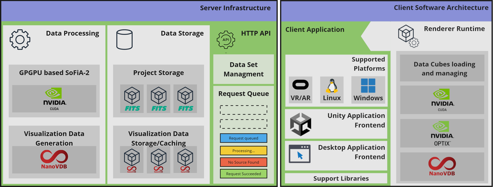

## B3D Visualization Project
B3D-vis is a research project developed by the Institute of Visual Computing at the University of Applied Sciences Bonn-Rhein-Sieg, based on the B3D initiative.

## Why b3d-vis?
This project was created as a proof of concept in different visualization scenarios as part of the research on the visualization of astronomical data.
The project is focused on covering two research scenarios. The first is to visualize HI-Datacube and perform a source search in noisy, unfiltered data. The Use case should demonstrate the iterative approach to source searching. For the source search, the project relies on the SoFiA2 algorithm. The desktop viewer was developed to cover that use case. The second scenario is the collaborative HI-Datacube investigation in the virtual environment, where multiple users/researchers can interact with different datasets.

Both use cases rely on the common Hi-Datacube renderer component based on the NanoVDB data structure. The original HI-datacubes data is stored in FITS file format, which is also used for input into the SoFiA2 algorithm. One of the components was created to implement the data-processing pipeline.

### Components Overview
The following diagram visualize the software architectural overview:



## Work in progress showcase
This showcase demo video tease the source search workflow on a desktop viewer application.
[](https://www.youtube.com/watch?v=FwjPuBjKzdI "Viewer Showcase Video")

Unfortunately, the source finding feature in the application is not usable due to several errors on the server. 

# Quick start

Download executables from releases section and run it.


# Build instruction

## Prerequisites
Also make sure CMake Version 3.26 is installed.
The project uses CMake presets, so depending on the system an correct preset must be chosen.

For installing the [vcpkg](https://github.com/microsoft/vcpkg) packet manager, clone the repository and navigate to vcpkg folder:
```
git clone https://github.com/microsoft/vcpkg.git
cd vcpkg
```
Than execute `.\bootstrap-vcpkg.bat` on Windows or `.\bootstrap-vcpkg.sh` on Linux.

## Configure CMake
Make sure that CUDA and OptiX libraries are installed on your system correctly.

The SDK's can be downloaded from https://developer.nvidia.com/cuda-downloads and https://developer.nvidia.com/designworks/optix/download

After the install make sure that the environment variables OPTIX_PATH and CUDA_PATH are set properly, alternatively this variables can be provided manually into a CMake configuration.

Next we move to the project build steps.

```
git clone https://github.com/Institute-of-Visual-Computing/b3d-vis.git --recursive
```
or update modules manually with
```
git submodule init
```
```
git submodule update --init --recursive
```
The project uses CMake presets, so we have following options to choose from:

>- x64-debug
>- x64-release
>- x64-debug-profiling
>- x64-release-profiling


The profiling related presets enables Tracy profiler performance metrics collection. It is usually only used for development.

## Build desktop viewer

```
cd b3d-vis
cmake --build --preset x64-release
```

than switch to default build folder and run the viewer with following arguments:

### Windows
```
cd out/build/x64-release/viewer
./NanoViewer.exe --renderer FitsNvdbRenderer
```

### Linux
```
cd out/build/x64-release/viewer
NanoViewer --renderer FitsNvdbRenderer
```

## Build server application

```
cd b3d-vis
cmake --build --preset x64-release
```

## Build Unity Extension
The unity extension requires additional option BUILD_UNITY_EXTENSION and optionally for the install target you can proide a install path targeting your unity project. See Unity example project https://github.com/Institute-of-Visual-Computing/b3d-vis-collaborative-demo

```
cmake --build --preset x64-release -D BUILD_UNITY_EXTENSION=ON -D UNITY_PROJECT_ROOT_DIR=<path_to_unity_project>
```
